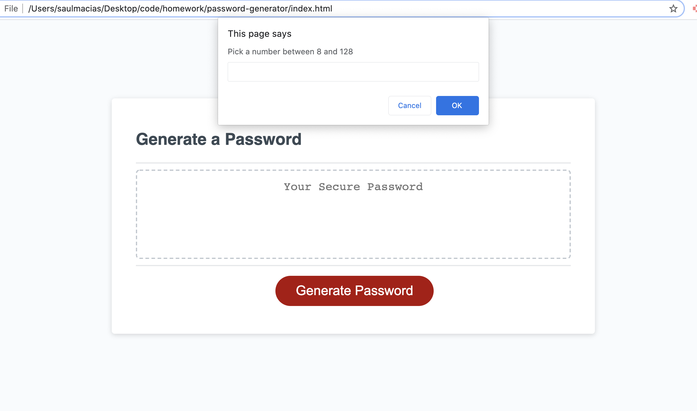

# password-generator
Password generator is basic website that developes a random password. The site allows you to pick parameters that include: lowercase letter, uppercase letters, symbols, and numbers. Based on a few prompts the user can make selections and then get random password.

[password-generator](https://github.com/Sm-801/password-generator.git). Is hosted on github pages. 